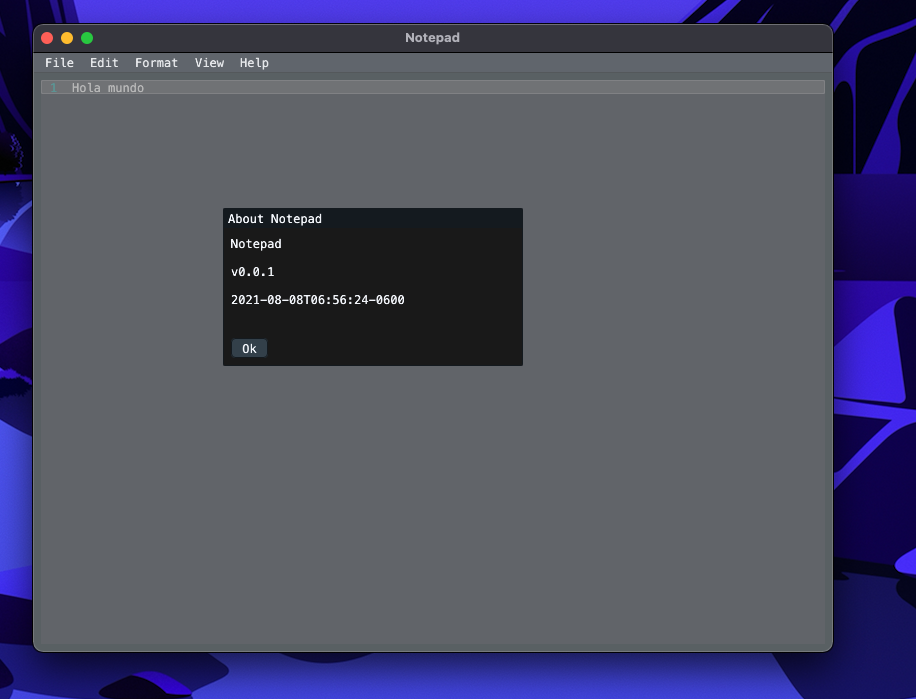
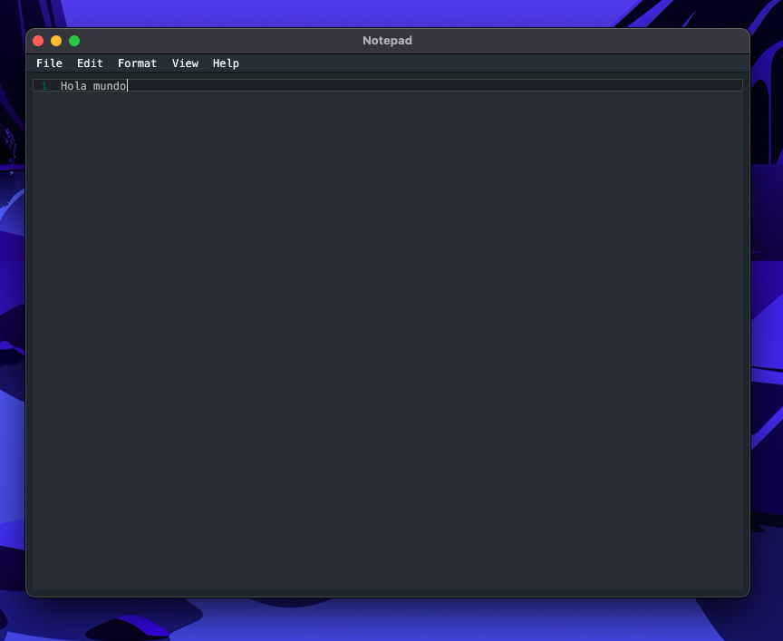
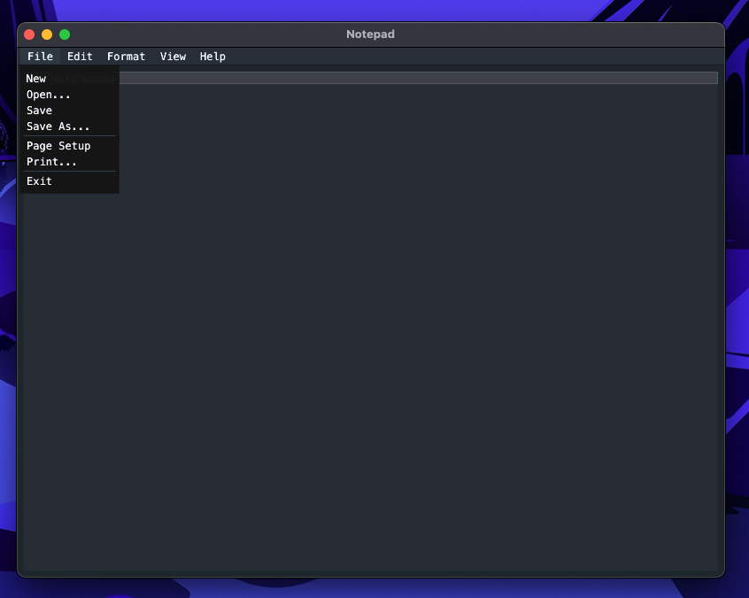

# Notepad-go

Notepad-go was created mainly in an attempts to learn [giu](https://github.com/AllenDang/giu)
and do something just a bit more complex than the standard "Hello World"

This is a skeleton application and has little to no functionality implemented.

Inspiration for this was mainly the need to have something on OSX that I could
quickly cut/copy/paste/write/hackup in; like Notepad.exe on Microsoft's Windows.

## Screenshots

"About Notepad" message box

Text editor view

File menu
